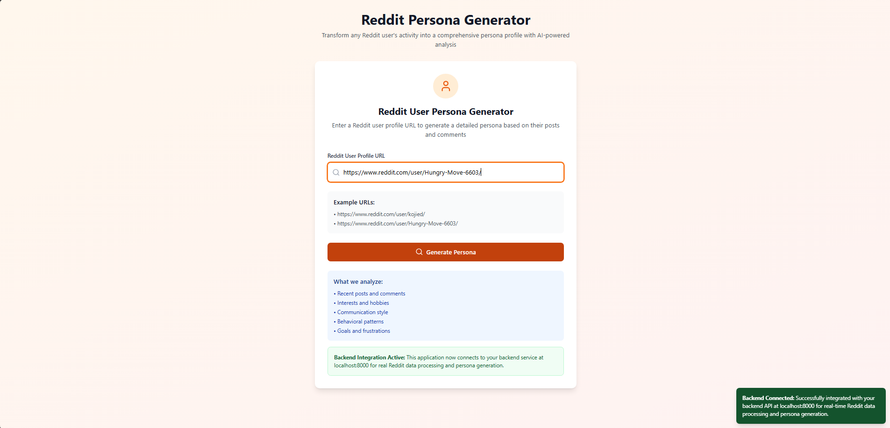
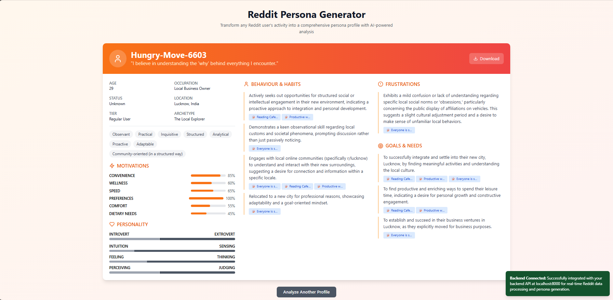

---

# 🧠 reddit-persona

**Reddit Persona Analyzer** is a full-stack web application that generates a psychological profile of any Reddit user by analyzing their public posts and comments. It uses language patterns, subreddit behavior, and prompt-driven reasoning to infer MBTI-style personality traits, behaviors, goals, and frustrations with the help of Large Language Models (LLMs).

<div align="center">
  
  <p><em>Enter a Reddit profile URL to analyze</em></p>
</div>

---

## 🚀 Features

* 🔍 Analyze any Reddit user's public activity
* 🧬 Auto-generates MBTI-style personality metrics
* 📊 Presents traits, behaviors, goals, and frustrations
* 🧠 Powered by LLMs (OpenAI/Gemini/Claude-compatible)
* ⚡ Fast, responsive UI with backend integration

---

## 🧰 Tech Stack

| Layer    | Technology                                 |
| -------- | ------------------------------------------ |
| Frontend | React + TypeScript + Tailwind CSS          |
| Backend  | Node.js + Express + OpenAI-compatible LLM  |
| LLM      | Gemini, GPT, Claude (configurable via API) |
| Styling  | Tailwind CSS, Lucide Icons                 |
| API Comm | REST over Axios                            |

---

## 📁 Project Structure

```
reddit-persona/
├── backend/
│   └── src/
│       ├── llm/          # LLM interaction & prompt logic
│       ├── routes/       # API route handlers
│       └── utils/        # Data transformers & helpers
├── frontend/
│   └── src/
│       ├── components/   # React components (e.g., URLInput)
│       ├── types/        # Shared TypeScript types/interfaces
│       └── utils/        # Client-side utilities
├── images/               # Screenshots used in README
└── README.md
```

---

## 🛠️ Getting Started

### ✅ Prerequisites

* Node.js (v18 or newer)
* npm or yarn
* (Optional) OpenAI / Gemini / Claude API key(s)

---

### 🧪 Local Development

#### 1️⃣ Clone the Repository

```bash
git clone https://github.com/your-username/reddit-persona.git
cd reddit-persona
```

---

#### 2️⃣ Backend Setup

```bash
cd backend
npm install
npm run dev
```

> 🔗 Runs at: `http://localhost:8000`

**Environment Setup:**
Create a `.env` file in the `backend/` directory and add your API keys:

```env
GEMINI_API_KEY=your_gemini_key
OPENAI_API_KEY=your_openai_key
```

---

#### 3️⃣ Frontend Setup

```bash
cd ../frontend
npm install
npm run dev
```

> 🌐 Opens at: `http://localhost:5173`

---

## 🔗 API Overview

### **POST** `/api/user/link`

**Request:**

```json
{
  "url": "https://www.reddit.com/user/username/"
}
```

**Response:**

```json
{
  "userInfo": { ... },
  "userPosts": [ ... ],
  "reply": "AI-generated persona summary"
}
```

---

## 🖼️ Screenshots

### 🔍 Input Page



### 🧠 Generated Persona



---

## 💡 Example URLs to Try

* `https://www.reddit.com/user/kojied/`
* `https://www.reddit.com/user/Hungry-Move-6603/`

---

## 📄 License

MIT License © 2025 [Abhik4004](https://github.com/Abhik4004)

---
